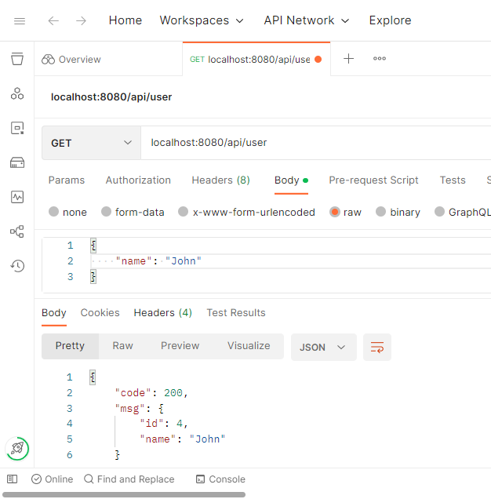
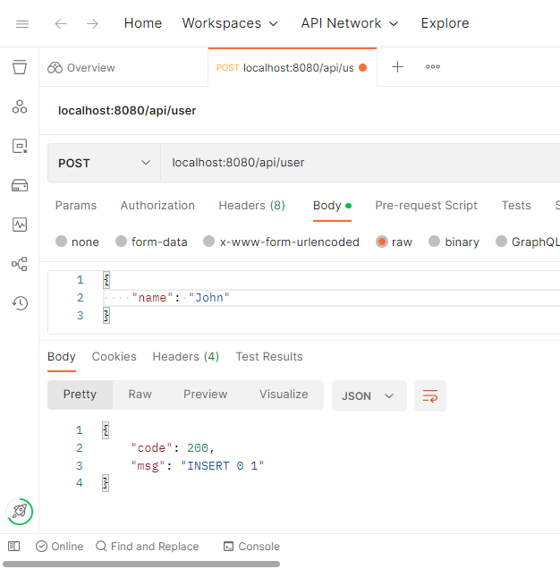
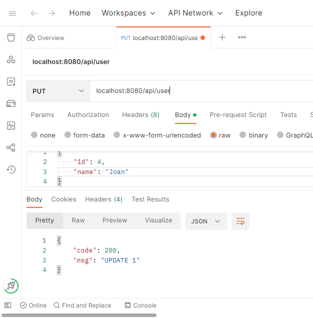

The given implements a RESTful CRUD API using an asynchronous framework AIOHTTP. 

Communication between the client and the server is implemented via JSON. All the fields and IDs are in an attached to a request JSON.  

1. `/ | GET` - an index page. Print `Hello world!`
2. `/api/user | GET` - get a row with the specified fields  
3. `/api/user | POST` - create a row with the specified fields 
4. `/api/user | PUT` - update a row with the specified ID and new values 
5. `/api/user | DELETE` - delete a row with the specified ID or fields

Here are some illustrations: 

